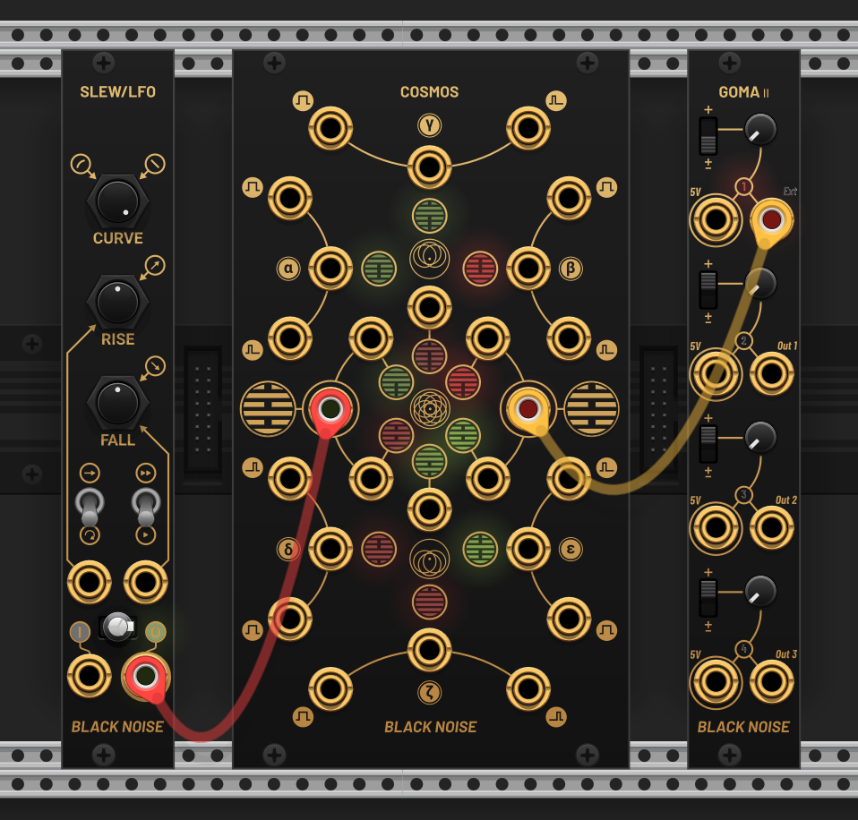

This repo contains VCV ports of Black Noise Modular Eurorack modules. See: https://blacknoisemodular.com/.

License: GPL-3.0-or-later 

## Differences with hardware

We have tried to make the VCV implementations as authentic as possible, however there are some minor changes that have been made (either for usuability or to bring modules in line with VCV rack conventions and standards).

General
* Polyphony: COSMOS, SlewLFO and GOMA II are polyphonic in VCV!

SlewLFO
* In LFO mode, the effect of the curve knob is rather minimal, whereas in the VCV version it has a similar response to the slew mode
* In LFO mode _and_ fast mode, the audio rate waveform is by default centred to run -5 → +5V (i.e. no DC component) rather than the usual 0 → 10V - this can be disabled in the context menu if need be. 
* (Minor) On hardware, the input LED can display the voltage at input jack even if not used (e.g. in LFO mode)

COSMOS
* The module can optionally clip at ±10V (rail voltage)

## Source repo for hardware versions

More information and resources for the hardware versions can be found at https://github.com/BlackNoiseModular/Eurorack

## Screenshots

